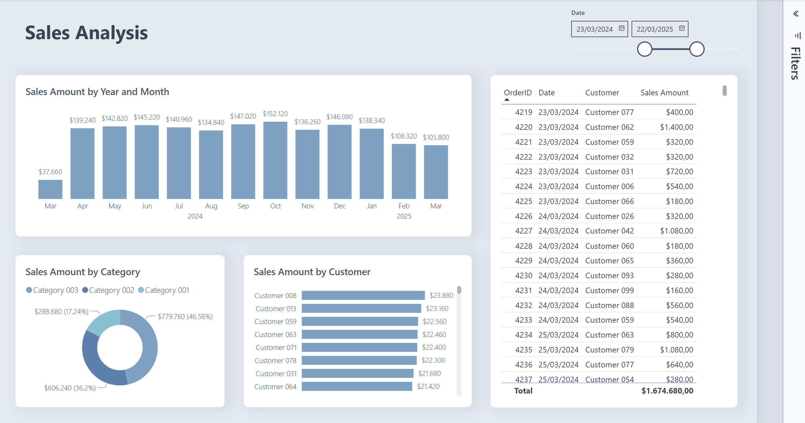

# Power BI Themes  
This repository gathers my favorite themes, tips, and tools for designing reports in Power BI.

# Nord theme

This is a port of open source project called Nord theme designed by Artic Ice Studio.  
Repository: [https://github.com/nordtheme/nord](https://github.com/nordtheme/nord)  

I've ported two versions: Nord is a dark dimmed theme and Polar is a clean theme based on original official pallete colors.  
Just download the json files and apply on Power BI Desktop.  

## Nord  

  
[Download JSON](./nord/nord.json)  
[Download Sample PBIX](./nord/nord_sample.pbix)  

## Polar  

  
[Download JSON](./polar/polar.json)  
[Download Sample PBIX](./polar/polar_sample.pbix)  

## Sources and useful links

#### [Report JSON Schema from Microsoft](https://github.com/microsoft/powerbi-desktop-samples/blob/main/Report%20Theme%20JSON%20Schema/README.md)  

#### [Coolors.co: My favorite site to generate and test palettes](https://coolors.com)  

#### [JSON Crack Extension](https://marketplace.visualstudio.com/items?itemName=AykutSarac.jsoncrack-vscode)  

